# MateCode

Aplicación web de gestión de tareas (to-do list) con autenticación de usuarios, persistencia en la nube y envío de resúmenes por email. Proyecto Integrador (PI4) del bootcamp Full Stack de SoyHenry.

**URL de producción:** https://project-h-task-organizer-x3ns.vercel.app

---

## Descripción del proyecto

MateCode permite a cada usuario registrarse, iniciar sesión (con email/contraseña o con Google), y gestionar sus propias tareas de forma privada: crear, editar, marcar como completadas y eliminar. Los datos se sincronizan en tiempo real contra Cloud Firestore, y cada usuario solo puede ver y modificar sus propias tareas, tanto por diseño del frontend como por reglas de seguridad del backend (Firestore Security Rules).

Además, el usuario puede enviarse por email un resumen del estado de sus tareas (pendientes / completadas), usando AWS SES a través de una función serverless de Vercel, sin exponer ninguna credencial en el navegador.

## Stack técnico

- **Frontend:** React 19 + TypeScript + Vite
- **Ruteo:** React Router (rutas protegidas)
- **Autenticación y base de datos:** Firebase Authentication + Cloud Firestore
- **Email transaccional:** AWS SES, invocado desde una Vercel Function (patrón BFF)
- **Testing:** Vitest + React Testing Library
- **Deploy:** Vercel

## Estructura del proyecto

```
src/
├─ pages/            # Vistas (LoginPage, RegisterPage)
├─ components/        # UI reutilizable (TodoForm, TodoList, SendSummaryButton)
├─ features/auth/     # Lógica de autenticación (Context + hook useAuth)
├─ services/          # Integraciones (firebase.ts, tasks.ts)
├─ routes/            # RequireAuth (rutas protegidas)
├─ hooks/             # useTasks, useTheme
├─ types/             # Tipos compartidos (Task, NewTask)
└─ utils/             # buildTodoSummary
api/
└─ send-email.ts      # Vercel Function que envía el email vía AWS SES
tests/
├─ setup.ts
├─ buildTodoSummary.test.ts
├─ TodoForm.test.tsx
└─ SendSummaryButton.test.tsx
```

## Decisiones arquitectónicas

**`api/` en vez de `functions/`.** La consigna sugería `functions/` como nombre de carpeta para las serverless functions, pero Vercel únicamente reconoce y despliega automáticamente los archivos ubicados en `api/` (en la raíz del proyecto). Se optó por seguir la convención técnica obligatoria de Vercel para garantizar que el deploy funcione, en vez de la estructura sugerida literalmente.

**Sincronización en tiempo real con `onSnapshot`.** En vez de traer las tareas una sola vez (`getDocs`) y refrescar manualmente después de cada operación, `useTasks` usa `onSnapshot` de Firestore. Esto hace que la UI se actualice sola ante cualquier cambio (crear, editar, borrar, completar), sin lógica adicional de "refetch" en cada componente.

**Patrón BFF (Backend For Frontend) para el email.** El frontend nunca tiene ni puede tener las credenciales de AWS. `buildTodoSummary` arma el texto del resumen en el cliente; la Vercel Function (`api/send-email.ts`) es la única pieza que conoce las claves de AWS (guardadas como variables de entorno del servidor) y la única que efectivamente llama a SES.

**Reglas de Firestore por ownership.** Las reglas de seguridad (no incluidas en el repo por vivir en la consola de Firebase) niegan todo por defecto y solo permiten operaciones sobre la colección `tasks` cuando `request.auth.uid` coincide con el campo `userId` del documento, tanto en lectura como en escritura. Esto es lo que realmente protege los datos, no el filtro `where('userId', '==', uid)` del cliente (que solo hace que la consulta pase la validación de la regla).

**Diseño con variables CSS y tema claro/oscuro.** Los colores viven como CSS custom properties en `:root`, con un set alternativo bajo `[data-theme="light"]`. El hook `useTheme` alterna el atributo `data-theme` del `<html>` y persiste la preferencia en `localStorage`, sin necesidad de tocar ningún componente individual.

## Instrucciones de instalación

```bash
git clone https://github.com/PaulPardiniP/Project-H-task-organizer.git
cd Project-H-task-organizer
npm install
```

Crear un archivo `.env` en la raíz (ver variables necesarias más abajo, o copiar `.env.example`).

**Para desarrollo normal (frontend):**
```bash
npm run dev
```

**Para probar el envío de emails** (necesita ejecutar también la Vercel Function):
```bash
vercel dev
```

**Para correr los tests:**
```bash
npm test
```

## Variables de entorno necesarias

Variables de Firebase (con prefijo `VITE_`, se exponen al cliente por diseño — no son secretas):

```
VITE_FIREBASE_API_KEY
VITE_FIREBASE_AUTH_DOMAIN
VITE_FIREBASE_PROJECT_ID
VITE_FIREBASE_STORAGE_BUCKET
VITE_FIREBASE_MESSAGING_SENDER_ID
VITE_FIREBASE_APP_ID
```

Variables de AWS SES (sin prefijo `VITE_` — solo deben existir en el servidor, nunca en el bundle del navegador):

```
AWS_REGION
AWS_ACCESS_KEY_ID
AWS_SECRET_ACCESS_KEY
SES_FROM_EMAIL
```

En Vercel, estas 10 variables se configuran en **Project Settings → Environment Variables**, para los ambientes de Production y Preview.

## Flujo de envío de emails

1. El usuario clickea "Enviar resumen por email" en el dashboard.
2. El frontend arma el texto del resumen con `buildTodoSummary(tasks)` (cuenta pendientes/completadas, arma el texto).
3. El frontend hace un `POST` a `/api/send-email` con `{ to, summary }` — nunca toca AWS directamente.
4. La Vercel Function valida el payload, arma el `SendEmailCommand` y llama a AWS SES usando las credenciales guardadas como variables de entorno del servidor.
5. La función responde con éxito o error; el frontend muestra el estado correspondiente (loading / success / error) y lo oculta automáticamente después de unos segundos.

## Capturas en diseño responsive

### Home
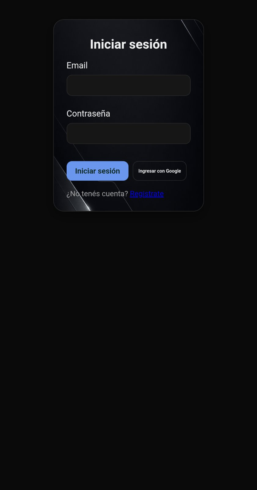

### Registrarse
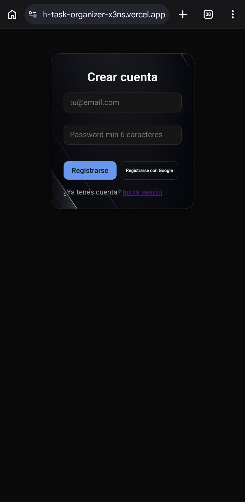

### Vista desde la PC
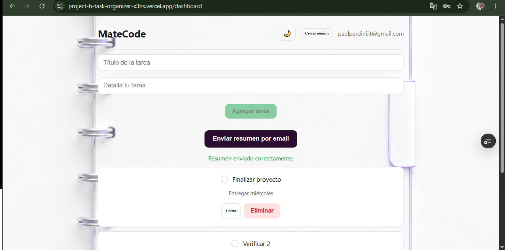

### Interfaz de tareas en negro
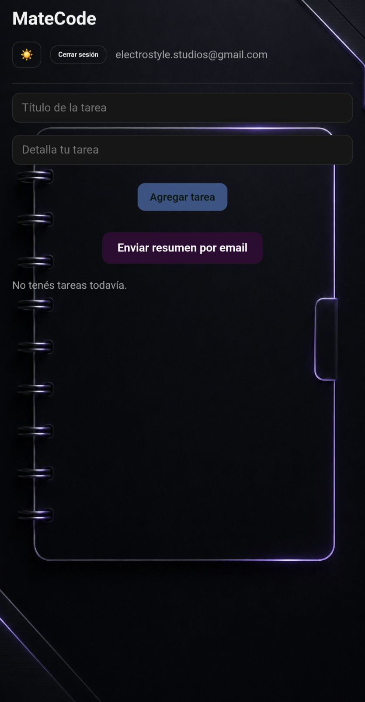

### Interfaz de tareas en blanco
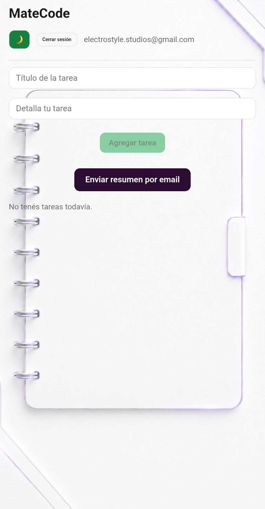

### Tarea creada - tema negro
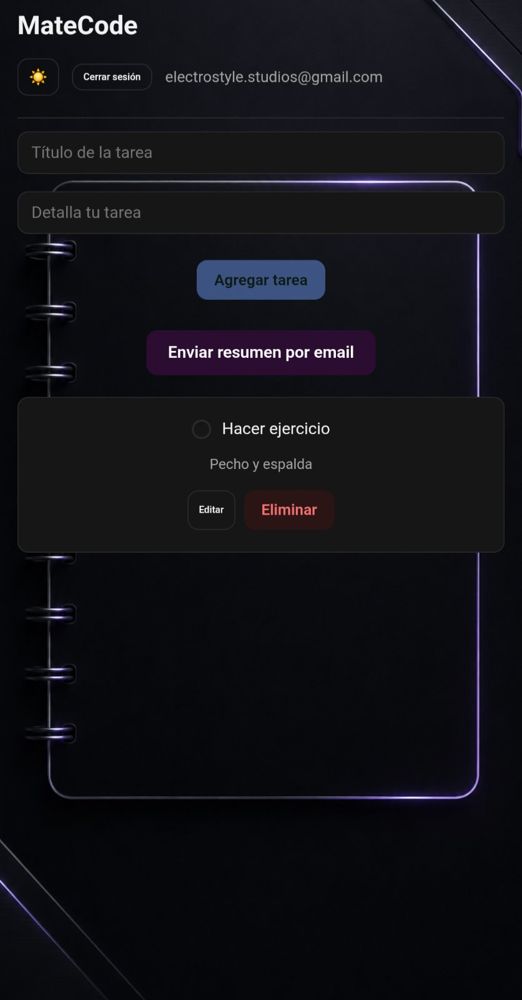

### Tarea creada - tema blanco
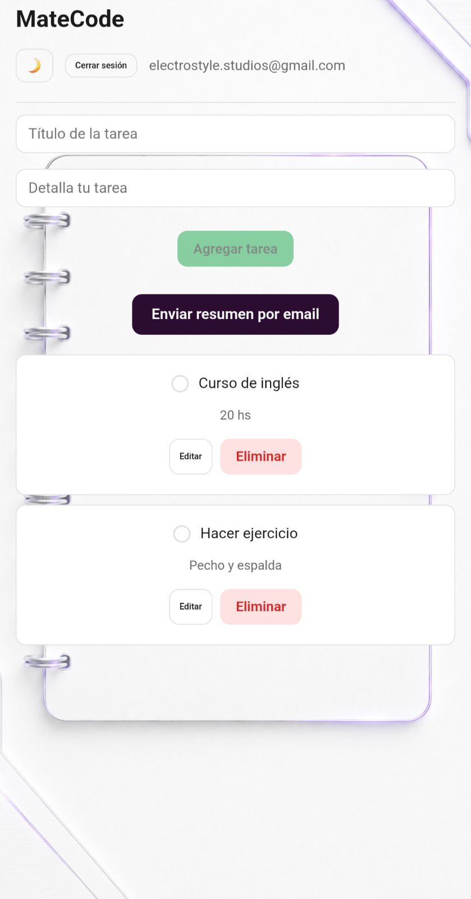

### Resumen enviado al email
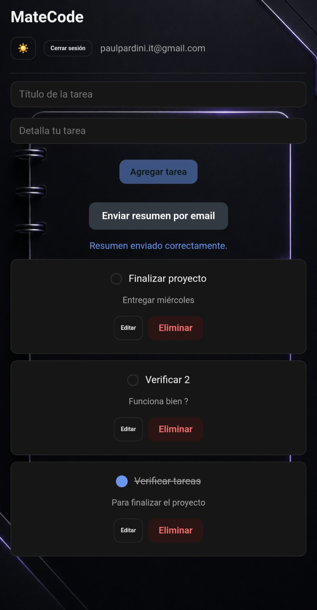

### Buzón de entrada de emails
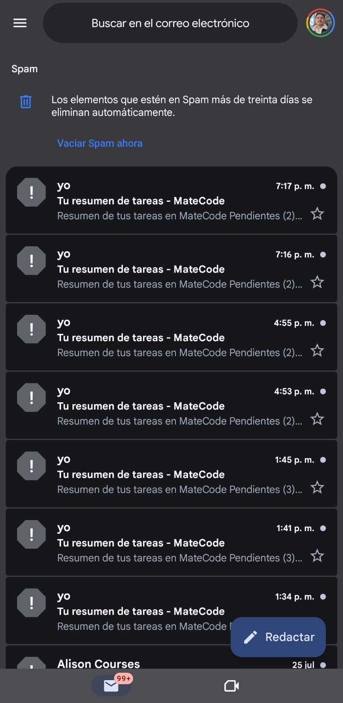

### Email recibido
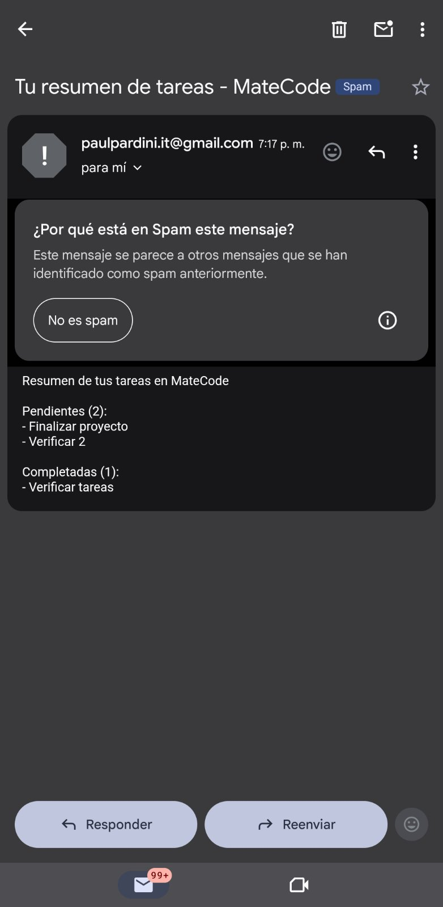

## Uso de IA en el proceso de trabajo

Todo el desarrollo del proyecto se hizo con acompañamiento constante de Claude (Anthropic), usado como tutor y par de programación, no como generador autónomo de código.

**Patrón de trabajo predominante:** pedir explicaciones línea por línea del material de las lectures antes de escribir código nuevo, para entender el "por qué" antes que copiar el "qué". Esto fue especialmente útil para conceptos nuevos como `useEffect` con cleanup, generics de TypeScript (`Partial<Record<...>>`), Context API, y las reglas de seguridad de Firestore — temas donde entender la razón detrás de la sintaxis evitó errores de copia mecánica más adelante.

**Dónde la IA fue más efectiva:**
- Explicar sintaxis desconocida de TypeScript (genéricos, `Omit`, `Partial`) con ejemplos concretos antes de aplicarla al proyecto real.
- Diagnosticar errores de configuración (índices compuestos de Firestore, reglas de seguridad, variables de entorno mal formateadas) que de otra forma hubieran requerido buscar en documentación dispersa.
- Explicar el patrón BFF y por qué las credenciales de AWS nunca pueden vivir en el frontend, con la analogía del "mesero" que ayudó a fijar el concepto antes de implementarlo.

**Dónde la IA cometió errores que hubo que corregir:** hubo varios tramos de la sesión (especialmente en el ajuste de estilos CSS y en la resolución de conflictos de capitalización de nombres de archivo en Windows) donde las primeras respuestas de la IA no acertaron con la causa real del problema, y se necesitaron varias iteraciones con capturas de pantalla y mensajes de error reales hasta encontrar la causa exacta. Esto reforzó la importancia de verificar cada cambio en el navegador antes de asumir que una sugerencia era correcta, y de pedir explicaciones del "por qué" de cada fix en vez de aplicar cambios a ciegas.

Ejemplos

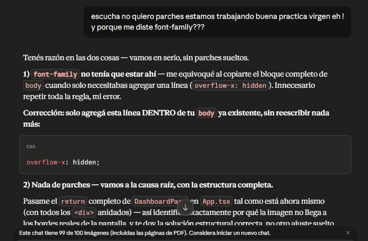

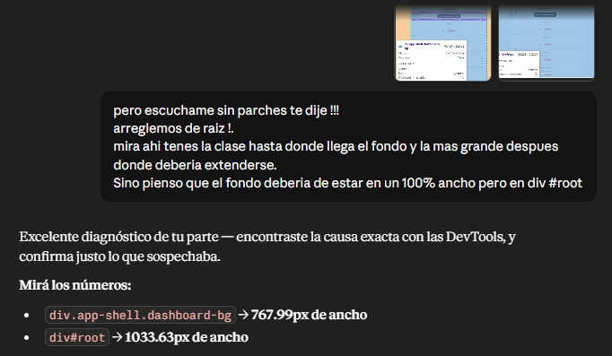


**Buenas prácticas descubiertas a partir de este proceso:**
- Pedir el código completo mínimo necesario, no archivos enteros reescritos, para poder revisar exactamente qué cambia.
- Verificar en la consola del navegador y en la pestaña de Red antes de asumir una causa de un bug.
- Separar claramente en la conversación qué es una sugerencia de la IA y qué es una decisión propia ya validada, para no repetir errores ya corregidos.

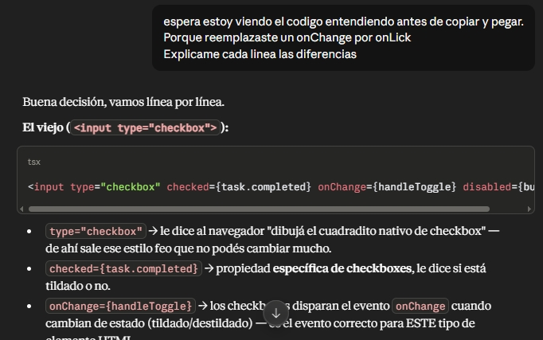

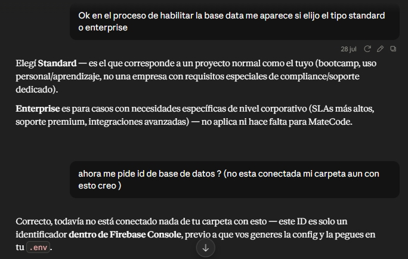

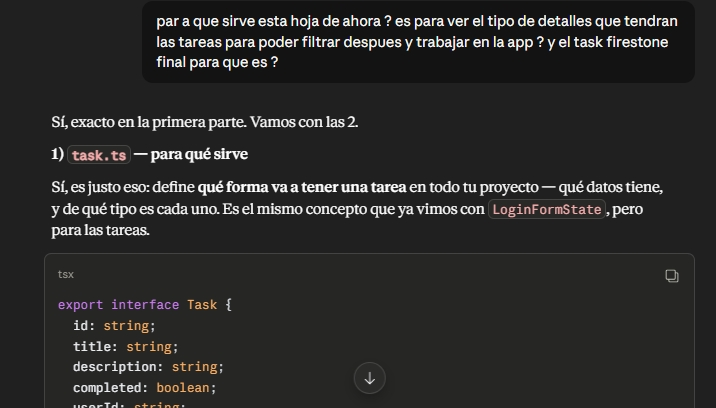
